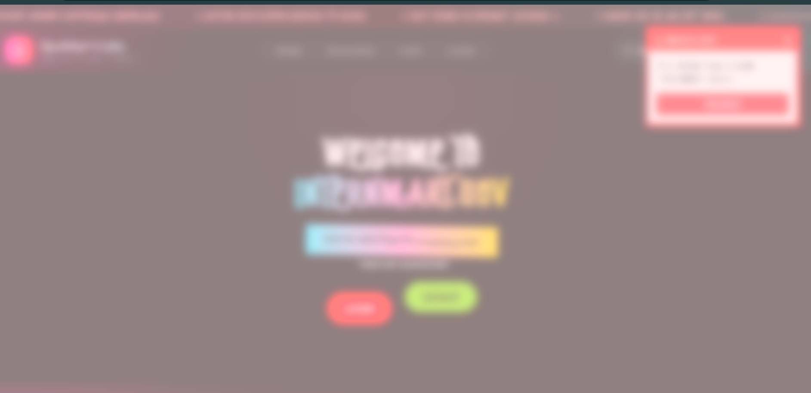
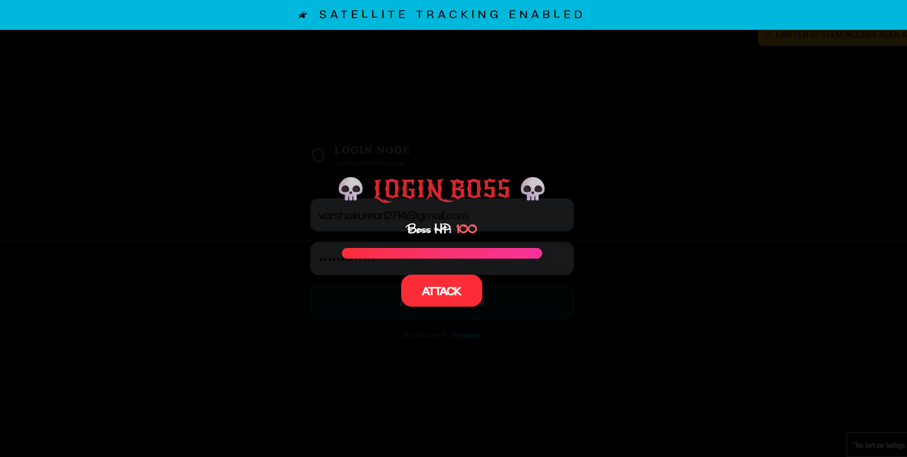
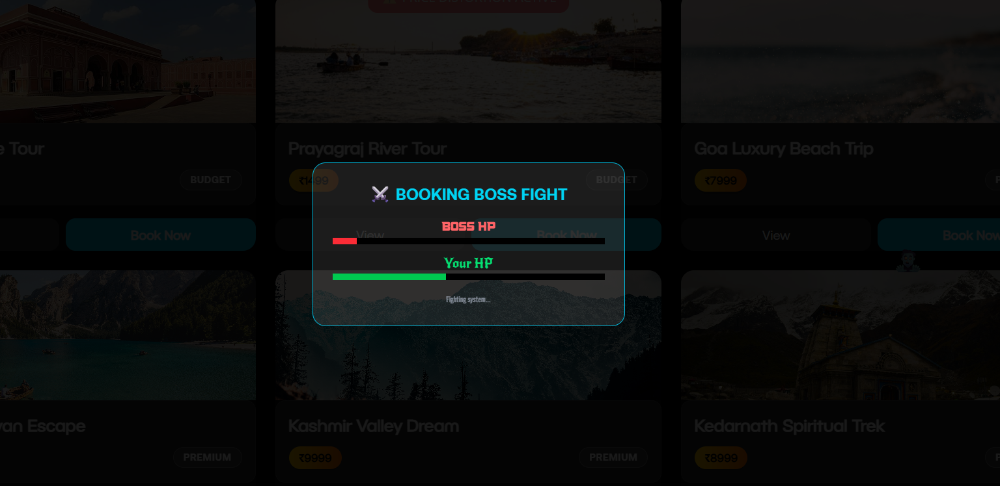
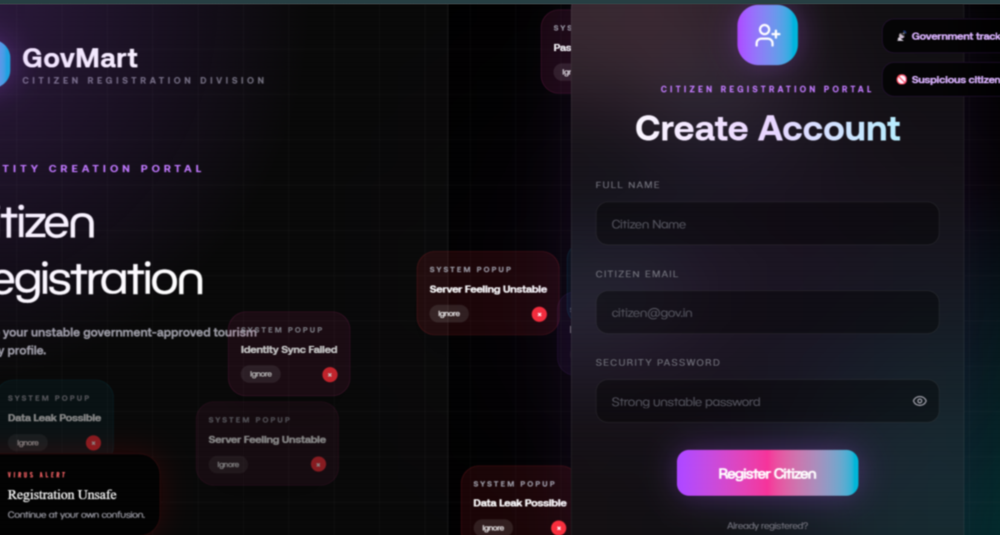

# 🎮 InternMart UI — Easter Eggs & Chaos Mode

> ⚠️ This project contains **hidden UI easter eggs, glitch effects, and game-style interactions**.  
> These are purely **frontend experiences** and do not affect backend logic.

---

## 🧠 Overview

InternMart is not just a UI — it's a **chaotic simulation system disguised as a travel/intern platform**.

It includes:

- 🎮 Boss fights
- 👻 Popups & fake alerts
- 🛰 Surveillance-style UI effects
- ⚡ Hidden triggers & keyboard secrets
- 💥 Random system glitches

---

# 📸 UI Preview (Screenshots)

> Replace these with real screenshots from your project

### 🔐 Landing Chaos Mode

---

### 🔐 Login Chaos Mode

### 👊 Boss Fight System

---

### 🛰 System Alerts / Glitches

---

### ⚔️ Packages Battle Mode

---

# 🎮 Features

## 🧠 Chaos Mode (Brainrot Overlay)

- 🔑 Trigger: `Alt + B`
- 💥 Fullscreen glitch/pink overlay
- ⏱ Auto disables after ~6 seconds

---

## 👊 Login Boss Fight

- Login replaced with **interactive battle system**
- Boss HP vs User Attack system
- Win → Login success + redirect `/dashboard`

---

## 👻 Cookie Mafia Popups

- Expanding annoying popup system
- Click = more chaos

---

## 📡 Fake Government Ads

- Periodic system alerts
- “LIMITED SYSTEM ACCESS AVAILABLE”

---

## 📟 Scanner Effect

- Mouse movement triggers scan lines
- Cyber surveillance feel

---

## 🧑‍💻 Clippy Chaos Assistant

- Delayed assistant popup
- “Need help hacking the login system?”

---

## 🚨 Random Ban Screen

- 15% chance on login
- Fullscreen “ACCOUNT BANNED” overlay

---

## 🛰 Satellite Tracking Banner

- Random top banner alerts
- Appears for ~4 seconds

---

## ⚔️ Book Now Boss Fight

- Packages page battle system
- Win → `/payment`
- Lose → failure alert

---

## ⏳ CAPTCHA Challenge System

- 20s timer challenge
- Auto redirect flow if timeout ends

---

## 🕵️ Thief Glitch Animation

- Moving thief sprite across screen
- Random interval trigger

---

## 💸 Server Glitch Alerts

- Random system error popups
- Adds chaos realism

---

# 🎯 Keyboard & Secret Triggers

| Action       | Effect              |
| ------------ | ------------------- |
| `Alt + B`    | Brainrot Chaos Mode |
| Mouse Move   | Scanner Lines       |
| Login Submit | Boss Fight Starts   |
| Book Now     | Battle Mode         |
| Random       | Ban Screen / Alerts |

---

# 🧩 Project Structure

---src/
├── pages/
│ ├── auth/
│ │ └── LoginPage.jsx
│ ├── Packages.jsx
│ └── dashboard/
├── components/
└── styles/

# ⚙️ Tech Stack

- ⚛️ React
- ⚡ Vite
- 🎨 Tailwind CSS
- 🎞 Framer Motion
- 🎮 Custom UI Game Logic

---

# ⚠️ Disclaimer

This project is designed for:

- 🎨 UI experimentation
- 🎮 gamified interfaces
- 🧪 frontend interaction learning

---

⭐ InternMart is not just a project — it's a controlled chaos simulator disguised as a UI system.
